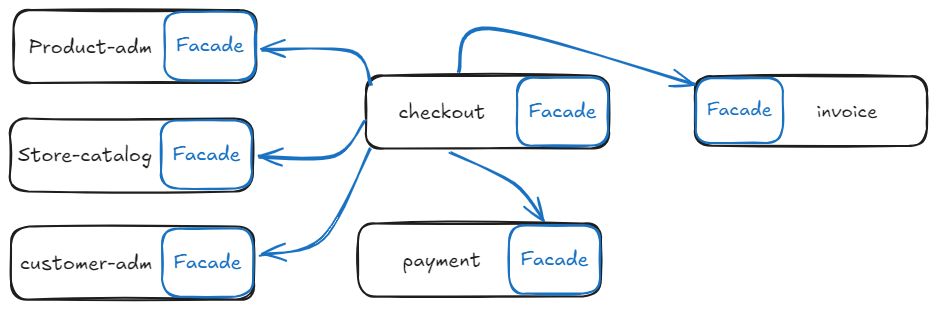

# Exemplo de Desenvolvimento de um Sistema Monolítico Modular

Este repositório contém um exemplo simplificado de um sistema monolítico modular, desenvolvido utilizando TypeScript, SQLite3 e Express. A estrutura segue os conceitos de **Clean Architecture** e **DDD**. A principal característica deste sistema é a utilização de **facades**, que simplificam a interação entre diferentes partes do sistema, oferecendo uma interface única e de alto nível para módulos complexos.

## Principais Características

- Módulos organizados em **bounded contexts**
- Comunicação entre módulos através de contratos e facades
- Entidades podem ser "duplicadas", contendo apenas os atributos necessários
- Equipes especializadas por módulos

## Representação Gráfica



### Módulos Independentes com Facades

- Cada módulo possui sua própria facade, o que significa que cada um expõe uma interface simplificada que pode ser usada por outros módulos ou partes do sistema, sem revelar detalhes da implementação interna.
- Na imagem, as setas indicam a comunicação entre os módulos. Por exemplo, o módulo `checkout` depende dos módulos `product-adm`, `store-catalog`, e `customer-adm` para suas funcionalidades. Ele acessa esses módulos por meio de suas facades, facilitando a integração.
- Os módulos `payment` e `invoice` também expõem suas interfaces (facades), que são utilizadas pelo módulo `checkout` para realizar operações relacionadas ao pagamento e à criação de faturas de forma encapsulada.
- As facades atuam como pontos de entrada centrais para a comunicação entre os módulos, garantindo que as interações sejam organizadas e que cada módulo possa evoluir de maneira independente, permitindo que o sistema seja escalável e de fácil manutenção.

## Referencial teórico

- [Os 4 tipos de Sistemas Monolíticos](https://fullcycle.com.br/os-4-tipos-de-sistemas-monoliticos/)

## Requisitos

Antes de começar, certifique-se de que você tem o seguinte instalado:

- [Node.js](https://nodejs.org) (versão 16.x ou superior)
- [Sqlite3](https://www.sqlite.org/docs.html)

ou docker + docker-compose...

## Configuração do Ambiente

### 1. Clonando o Repositório

Clone este repositório para a sua máquina local:
```bash
git clone https://github.com/Lucassamuel97/monolito
cd monolito
```

### 2. Instalando Dependências SQLite e migrations (Sequelize e Umzug), e executando a aplicação (Express)
```bash
npm install
node migrate up
npm run dev
```

### Executando aplicação somente com docker-compose
```bash
    docker-compose up --build
```